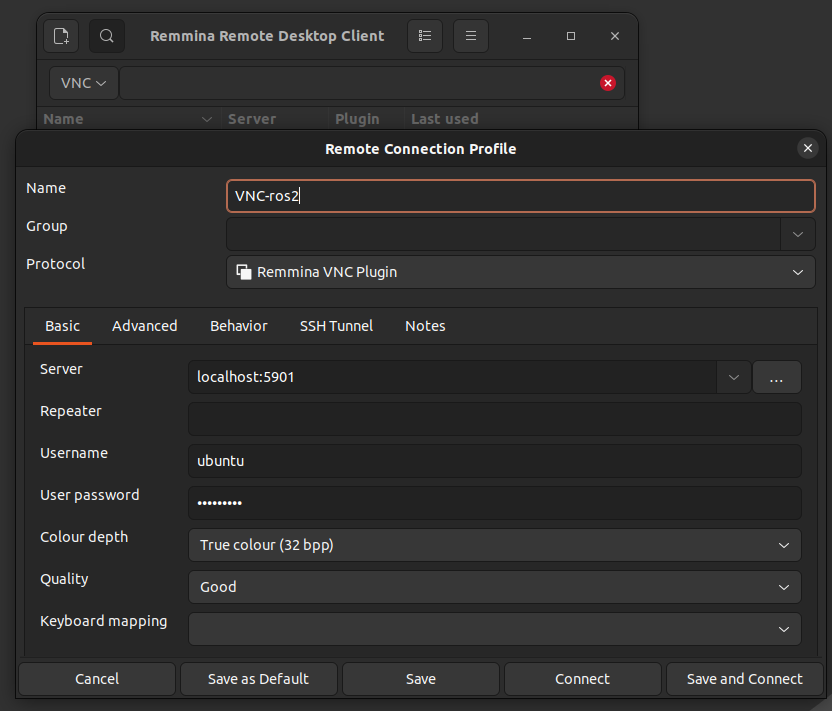
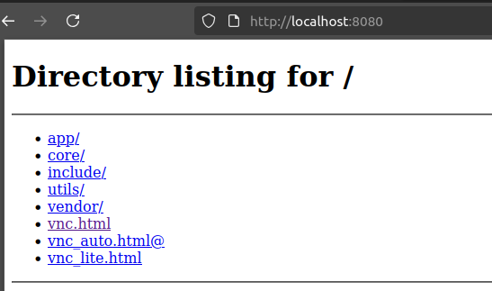

# Docker images for ROS 2 VNC

## Build the docker image

```sh
cd 01_jazzy-vscode-xfce-tigerVNC-novnc/
docker compose build
```

## Run the container

```sh
docker compose up
```

## Utilizing VNC on Ubuntu

### Using tigervnc

**Ubuntu**

```sh
sudo apt install tigervnc-viewer
```

```sh
vncviewer localhost:5901
```

### Using remmina

```sh
sudo apt install remmina
```

open remmina

```sh
# on a terminal
remmina
```

When it opens, choose VNC as protocol and connect to:

```sh
localhost:5901
```

<figure style="text-align: center;">
    
    <figcaption>Remmina remote connexion profile</figcaption>
</figure>

### Using noVNC

In the browser connect to http://localhost:8080/

<figure style="text-align: center;">
    
    <figcaption>Connect via noVNC</figcaption>
</figure>

## Utilizing VNC on Windows

### Using RealVNC Viewer

1. Download: https://www.realvnc.com/en/connect/download/viewer/
2. Install & open VNC Viewer
3. in the address bar enter:

```sh
localhost:5901
```

4. Connect → enter VNC password

## Troubleshooting

On windows:

- Firewall : "Allow app through Windows Firewall".

```

```
